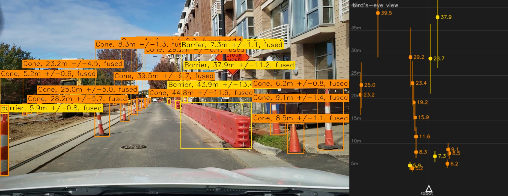
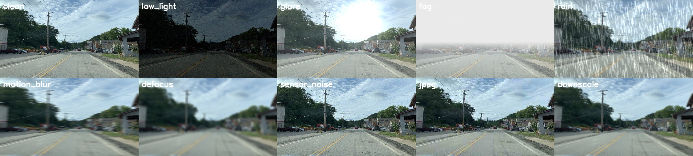
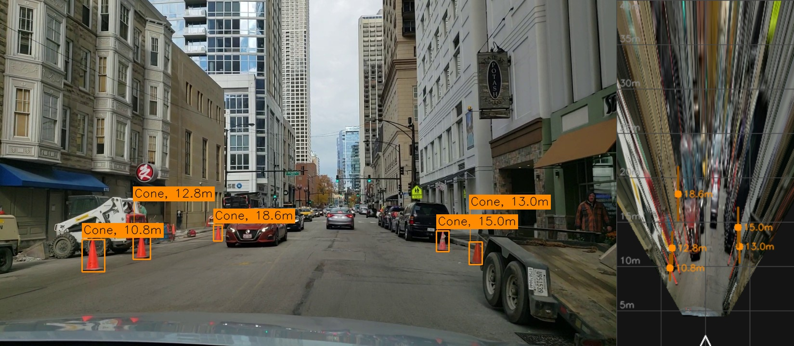

# Object Detection + Distance Estimation for Robotics Navigation

A geometry-aware YOLO11 perception pipeline that detects **cones, barriers and
stop signs**, estimates their **camera-relative distance from geometry** (not a
learned regressor), and evaluates practical **CPU/GPU edge optimisation** under a
leakage-free, corruption-aware test protocol.

```
Cone, 8.2m      Barrier, 15.1m      Stop Sign, 20.2m
```



*20 objects in one frame. Ranges 5.2 m to 44 m, with uncertainty growing as the
error model predicts (±0.6 m at 5 m, ±11.9 m at 44 m). Right panel is the metric
bird's-eye view.*

---

## Pipeline

```
                    ┌──────────────────────────────────────────────┐
  BGR frame ──────► │ DETECTION                                    │
                    │  COCO weights → BDD100K (10 cls) → nav (3 cls)│
                    │  YOLO11s / YOLO11n                           │
                    └───────────────────┬──────────────────────────┘
                                        │ boxes + classes
                    ┌───────────────────▼──────────────────────────┐
                    │ DISTANCE  (pure geometry, no learned depth)   │
                    │                                              │
                    │  cue A: apparent size   Z = fy·H / h_px       │
                    │  cue B: ground plane    Z = f(v_bottom, h, θ) │
                    │                    │                         │
                    │      inverse-variance fusion in log space     │
                    │      + analytic uncertainty propagation       │
                    └───────────────────┬──────────────────────────┘
                                        │ distance ± σ, forward/lateral
                    ┌───────────────────▼──────────────────────────┐
                    │ OUTPUT                                       │
                    │  "Cone, 8.2m" overlay  ·  bird's-eye view    │
                    │  3-D position for a planner                  │
                    └──────────────────────────────────────────────┘

  Evaluated under: leak-free clip/content split · 9 corruptions × 2 severities
  Deployed via:    ONNX INT8 · lightweight backbone · CPU + GPU benchmark
```

---

## Assignment requirements → implementation

| Requirement | Implementation | Where |
|---|---|---|
| Detect cones, barriers, stop signs | YOLO11s, 3-class unified taxonomy | [`configs/classes.yaml`](configs/classes.yaml) |
| Work with BDD100K | Domain-adaptive stage 1 **+** in-domain stop-sign mining | [`src/data/bdd100k.py`](src/data/bdd100k.py) |
| Transfer learning | COCO → BDD100K → navigation classes, with ablation | [`src/train/`](src/train) |
| Clean, modular implementation | `src/` library + `scripts/` CLIs, 89 tests | [`tests/`](tests) |
| Distance estimation per object | Two geometric cues, fused with uncertainty | [`src/distance/`](src/distance) |
| Distance from camera perspective | Pinhole model + ground plane + camera pose fit | [`docs/distance_estimation.md`](docs/distance_estimation.md) |
| Annotation format `Cone, 1.5m` | Exactly that; `--sigma` / `--method` optional | [`src/viz.py`](src/viz.py) |
| Optimisation: quantization | ONNX INT8 **static and dynamic**, FP16 | [Results](#edge-optimisation) |
| Optimisation: pruning | Unstructured (measured); structured (tooling-blocked) | [`src/optimize/prune.py`](src/optimize/prune.py) |
| Optimisation: lightweight backbone | YOLO11n, trained the same way | [Results](#edge-optimisation) |
| FPS on CPU **and** GPU | Both, end-to-end, two-pass timing | [Results](#edge-optimisation) |
| Before/after comparison | Full table incl. negative results | [`docs/results.md`](docs/results.md) |
| *Extra:* epipolar geometry | Disparity–depth derivation + **motion stereo on real clips** | [`docs/epipolar_geometry.md`](docs/epipolar_geometry.md) |
| *Extra:* homography / BEV | Metric IPM built from the camera model | [`src/geometry/bev.py`](src/geometry/bev.py) |
| *Extra:* optical flow | Cone tracking + range rate + **time-to-collision** | [`src/geometry/optical_flow.py`](src/geometry/optical_flow.py) |

---

## Results

All figures are on **my verified leak-free navigation-object evaluation split**.
They are *not* directly comparable to published BDD100K benchmarks — the class
set, data sources, subset and split protocol all differ.

### Detection

| model | mAP50-95 | mAP50 | precision | recall |
|---|---|---|---|---|
| **YOLO11s, two-stage** (COCO→BDD100K→nav), 25 ep | **0.4515** | **0.6627** | 0.778 | 0.619 |
| YOLO11n, two-stage (edge model), 12 ep | 0.3852 | 0.5920 | 0.749 | 0.544 |
| stage 1 alone, BDD100K 10-class | 0.238 | 0.427 | — | — |

Per-class (YOLO11s): `stop_sign` **0.714**, `cone` **0.349**, `barrier` **0.292**.
Stop signs are large, high-contrast and standardised; cones and barriers are
dominated by small distant instances, which the robustness section quantifies.

### Distance estimation — reported as *consistency*, not accuracy

**None of these datasets contains ground-truth distance.** I did not manufacture
an accuracy number. The estimator is validated two ways instead:

| validation | result |
|---|---|
| Synthetic scenes with exact boxes (known ground truth) | range recovered to **< 2 %** |
| Cue agreement, held-out val cones | 1.119× → **1.010×** |
| Cue agreement, **barriers — never used in the fit** | 1.401× → **0.998×** |

Fitted camera: **height 1.38 m, pitch −0.53°**. Proper accuracy validation needs
a depth-equipped dataset (KITTI, nuScenes) or calibrated measurements; that is
stated as future work, not glossed over.

### Robustness and small objects

Clean mAP50-95 0.413, stratified by object size — the first row is the one that
matters for navigation:

| object size | AP |
|---|---|
| **small (< 32² px)** | **0.223** |
| medium | 0.564 |
| large | 0.701 |

**88.6 % mean retained mAP50-95** across 9 corruptions × 2 severities:

| corruption | retained (sev 2 / sev 4) |
|---|---|
| sensor noise | 100.3 % / 99.8 % |
| downscale | 100.1 % / 96.9 % |
| rain | 99.0 % / 93.8 % |
| JPEG | 99.0 % / 95.7 % |
| glare | 98.9 % / 98.9 % |
| low light | 98.4 % / 79.3 % |
| defocus | 98.4 % / 80.8 % |
| motion blur | 92.1 % / 62.4 % |
| **fog** | **53.2 % / 47.4 %** |

Fog is the clear weakness, and honestly so: the evaluation fog is depth-correct
and erases the far field, which is exactly where the hard objects live.

### Edge optimisation

End-to-end latency (letterbox + forward + NMS), two-pass timing, one evaluator
for every backend.

**CPU** — Intel i7-14650HX:

| variant | size | FPS | speed-up | mAP50-95 |
|---|---|---|---|---|
| YOLO11s FP32 PyTorch *(baseline)* | 19.2 MB | 26.0 | 1.00× | 0.406 |
| YOLO11s FP32 ONNX | 37.9 MB | 25.0 | 0.96× | 0.407 |
| **YOLO11s INT8 static ONNX** | **11.4 MB** | **30.6** | **1.18×** | 0.400 |
| YOLO11s INT8 dynamic ONNX | 9.9 MB | 2.0 | **0.08×** | 0.397 |
| YOLO11s 30 % unstructured-sparse | 19.2 MB | 22.1 | 0.85× | 0.404 |
| **YOLO11n FP32 PyTorch** | **5.5 MB** | **37.6** | **1.44×** | 0.358 |

**GPU** — RTX 4060 Laptop: YOLO11s FP32 **151.9 FPS**, FP16 141.8 (0.93×),
YOLO11n 140.6 (0.93×).

---

## Three things worth a reviewer's attention

### 1. The split was audited for leakage before any metric was reported

ROADWork frames are video frames; two frames 30 ms apart are the same picture.
Splitting at frame level makes validation measure memorisation — *silently*,
because the loss curves stay healthy and val mAP still rises.

The audit ([`scripts/check_leakage.py`](scripts/check_leakage.py)) found the
official ROADWork GPS split shares **222 video clips** between train and val:
**787 validation frames (35.5 %)** came from a clip the model also trained on,
plus 28 identical file stems. A subtler one followed: ROADWork ships some
captures **twice under unrelated names** (`rw_IMG_9116` is byte-identical to
`rw_pgh02_0010`), which no filename-based grouping can see.

The split was rebuilt ([`scripts/resplit.py`](scripts/resplit.py)) grouping by
**source clip *and* image content hash**, with an **embargo** at clip boundaries
so a train chunk never sits beside a val chunk.

| check | before | after |
|---|---|---|
| identical file stems | 28 | **0** |
| shared source clips | 222 (787 frames, 35.5 %) | **0** |
| near-duplicate frames | 7 / 1200 | **0 / 2481** |
| verdict | LEAKAGE DETECTED | **clean** |

Caught before stage-2 training, so no compute was wasted, and every number above
is measured on a genuinely held-out split.

### 2. Distance comes from geometry, as the brief asks

No neural network estimates distance anywhere in this project. Two independent
cues, fused by inverse variance in log space, with **analytic** Jacobians:

- **apparent size** `Z = fy·H/h_px` — needs a physical size prior (US MUTCD);
  relative error floors at the real spread of object sizes (~19 % for cones);
- **ground plane** `Z = h(cosθ − ṽ·sinθ)/(ṽ·cosθ + sinθ)` — needs no size prior;
  error grows **quadratically** with range.

They fail in opposite ways, so fusion is automatic rather than hand-tuned: the
ground cue dominates up close, the size prior takes over far away. Elevated
objects (stop signs) need no special case — their foot lies on a plane
`h_eff = h_camera − mount_height`, the same equation. Disagreement beyond 1.6× is
**surfaced as a flag**, not averaged away.

Calibration exposed four problems that would each have silently corrupted every
distance — `fy` is unidentifiable from cue agreement; the data contains **three
different cameras**; small boxes bias the height estimate upward
(errors-in-variables); and height/pitch are degenerate against each other. Each
is documented with its fix in
[`docs/distance_estimation.md`](docs/distance_estimation.md).

### 3. Optimisation results are measured, not assumed — including three negatives

A table of only wins would be a table built to look good. Four findings:

1. **INT8 dynamic quantisation is 13× *slower*** (2.0 vs 26.0 FPS). The obvious
   "just quantise it" move is the worst row in the table — per-op runtime
   activation-range computation dominates a conv-heavy network. Only *static*
   INT8, with calibrated ranges, actually helps.
2. **FP16 on GPU is slower than FP32**, and so is YOLO11n. At this scale the GPU
   pipeline is bound by pre/post-processing, not the backbone — so shrinking the
   backbone buys nothing *there*. It buys 1.44× on CPU, where an edge device
   actually lives.
3. **Unstructured sparsity accelerates nothing** (30 % sparse = 0.85× baseline),
   verified against a control: the same checkpoint re-saved with **0 %** pruning
   times identically (27.0 vs 27.3 FPS). Sparse weights, dense kernels.
4. **30 % of weights can be zeroed for −0.005 mAP** (0.4515 → 0.4467) — useless
   for latency, genuinely useful for storage.

---

## Quick start

**Pretrained weights.** The final YOLO11s checkpoint is published as a **GitHub
release asset**, not committed to Git. Model weights, datasets and training runs
are deliberately excluded from history (`.gitignore`) to keep the repository
clone-able; everything needed to regenerate them is below. To run inference
without retraining, download `best.pt` from Releases and pass it to `--weights`.

```bash
pip install -r requirements.txt

# 1. fetch datasets (resumable, parallel; ~11 GB)
python scripts/download_data.py --all

# 2. build the unified 3-class dataset
python scripts/prepare_data.py --all --bdd-stage1

# 3. make the split honest, then prove it
python scripts/resplit.py       --dataset data/processed/nav --val-fraction 0.25
python scripts/check_leakage.py --dataset data/processed/nav --strict

# 4. train
python scripts/train.py stage1                          # BDD100K domain adaptation
python scripts/train.py stage2                          # cone / barrier / stop_sign
python scripts/train.py stage2 --from-coco --epochs 8   # ablation

# 5. fit camera pose from labelled cones
python scripts/calibrate.py --dataset data/processed/nav --write

# 6. run it  (rw_* = frames with valid dash-cam geometry)
python scripts/infer.py --weights <best.pt> \
    --source data/processed/nav/images/val --pattern "rw_*.jpg" --limit 12 --bev

# 7. optimisation, robustness, extra credit
python scripts/optimize.py        --weights <best.pt> --export --quantize --bench
python scripts/eval_robustness.py --weights <best.pt>
python scripts/demo_bev.py        --weights <best.pt> --pattern "rw_*.jpg"
python scripts/demo_tracking.py   --weights <best.pt> --sequence 5 --video
python scripts/demo_stereo.py     --weights <best.pt> --sequence 0 --gap 1

# 8. assemble every artefact into docs/results.md
python scripts/report.py

# tests: geometry + robustness, no data or GPU needed, ~3 s
python -m pytest tests/ -q        # 89 passed
```

---

## Method

### Datasets, and why BDD100K is not enough on its own

**BDD100K contains no cones and no barriers**, and its `traffic sign` class does
not distinguish stop signs — so it cannot supply any of the three target classes
directly. Three sources are combined:

| source | supplies | why |
|---|---|---|
| **ROADWork** (CMU, CC-BY) | `cone`, `barrier` | 7160 dash-cam work-zone frames, 27.3 k cone + 28.4 k barrier boxes |
| **BDD100K** | domain adaptation + in-domain `stop_sign` | see below |
| **COCO 2017** | `stop_sign` | the only large-scale stop-sign annotations |

BDD100K earns its place twice. **(a)** Stage-1 fine-tuning on its 10 driving
classes moves the COCO backbone from web photos into forward-facing road imagery
before it ever sees a cone. **(b)** Its 34 k dash-cam `traffic sign` boxes never
say *which* are stop signs, and a COCO detector fires on billboards — but
requiring **both** to agree at the same location yields clean, in-domain labels.
Precision comes from the agreement, not from trusting either source.

**The partial-label trap:** ROADWork frames contain unlabelled stop signs, each a
false negative teaching the model to suppress stop signs in exactly the viewpoint
we care about. [`src/data/pseudo_label.py`](src/data/pseudo_label.py) closes that
gap at a stricter threshold, since no second opinion exists there.

Final set: **6713 train / 2481 val** — 27.3 k cone, 28.4 k barrier, 2.6 k stop_sign.

### Detection

```
COCO weights ──► stage 1: BDD100K, 10 classes ──► stage 2: cone/barrier/stop_sign
   (YOLO11s)        8500 frames, 20 epochs          6713 frames, 25 epochs
                    → mAP50-95 0.238
```

The stage-1 head is discarded; only the domain-adapted backbone carries forward.
The edge model gets its **own** stage 1, since a YOLO11s checkpoint cannot
initialise a YOLO11n — otherwise the "with BDD100K vs without" comparison would
be confounded with a change of backbone.

**Does the BDD100K stage help?** In the only comparable window — the 3-epoch
warm-up, where both runs share an identical LR trajectory — the BDD100K-
initialised run leads by **+0.103, +0.049, +0.051** mAP50-95. Past warm-up the
8-epoch ablation's cosine schedule anneals faster than the 25-epoch run's, so
later epochs are not comparable; a matched 25-epoch ablation is the right next
experiment and was not affordable here. Stated rather than glossed.

### Hard conditions and evaluation integrity

ROADWork is almost entirely clear daylight. The augmentation
([`src/train/augment.py`](src/train/augment.py)) simulates the failure cases:
exposure, glare, weather, optics, sensor. The constraint that shapes it: **every
transform is pixel-level** — no rotation, shear or perspective warp, because a
geometric warp changes *apparent object height* and would silently corrupt
`Z = fy·H/h_px`. A test asserts this structurally.



*The nine evaluation corruptions at severity 3. The fog model is depth-correct
(Koschmieder scattering using per-row ground-plane depth), so the far field
disappears while the near road stays readable.*

Evaluation corruptions are implemented **independently** of the training
augmentation ([`src/data/degrade.py`](src/data/degrade.py)), so the benchmark
measures robustness rather than memorisation of one library's noise generator.

**A profiling find worth recording:** mid-training the GPU sat at **0–1 %
utilisation** while the CPU saturated. One transform was responsible —
`A.RandomFog` at **1809 ms/image**, against 1–50 ms for everything else.
Replacing it with a physical haze model took the stack from **230 ms → 23 ms per
image, a 10× training speed-up**.

### Edge optimisation — methodology

- **Latency is end-to-end** (letterbox + forward + NMS) because that is what
  bounds a control loop; timing the forward pass alone would flatter INT8.
- **Two-pass timing.** The first variant measured in a sweep read 11.6 FPS while
  the identical checkpoint measured back-to-back read 26.7 — CPU frequency ramp
  and cache warming. Taking the first number would have inflated every CPU
  speed-up ratio by more than 2×.
- **One evaluator for every backend** ([`src/optimize/cocoeval.py`](src/optimize/cocoeval.py)),
  so a PyTorch model and a quantised ONNX model are scored by identical code.

Structured pruning is implemented but did not complete: `torch-pruning`'s
dependency-graph build does not converge on YOLO11s (> 200 s on CPU *and* GPU,
while a forward pass takes 0.2 s), likely its C2PSA attention blocks. Reported as
a tooling limitation rather than dressed up.

### Extra credit — all three implemented



*Metric IPM bird's-eye view. The smeared buildings are the flat-world assumption
failing exactly as predicted — which is why detected objects are drawn as markers
at their estimated ground position rather than read off the warped image.*

**Epipolar geometry** — [`docs/epipolar_geometry.md`](docs/epipolar_geometry.md)
derives `Z = f·B/d` and `σ_Z = Z²·σ_d/(f·B)`. Since the data is monocular,
[`scripts/demo_stereo.py`](scripts/demo_stereo.py) treats consecutive frames as a
stereo pair. On a real clip: **313 inliers, 0.52 px** median epipolar error,
recovered translation `[-0.009, 0.006, -1.000]` — almost perfectly forward, the
correct answer for a dash-cam. The scale-anchored cross-check returned nothing,
for the reason the doc predicts: under pure forward motion the epipole sits at
the image centre, exactly where the cones are, so their triangulation is
ill-conditioned. A predicted failure is still a result.

**Homography / BEV** — [`src/geometry/bev.py`](src/geometry/bev.py) builds the IPM
homography directly from the camera model (`H = K·[r₁|r₃|h·r₂]`), so the canvas
is metric and consistent with the reported distances.

**Optical flow** — [`src/geometry/optical_flow.py`](src/geometry/optical_flow.py)
tracks objects with IoU + Lucas-Kanade (pure IoU breaks when the robot moves fast
enough that boxes stop overlapping). Tracking buys **range rate and
time-to-collision**, fitted by least squares over a window rather than
differenced between adjacent frames. On a 23-frame clip: 10 confirmed tracks,
e.g. cone #61 closing at **−3.15 m/s, TTC 4.15 s**.

---

## Limitations

1. **No distance ground truth exists in any of these datasets.** Every distance
   figure is a consistency or self-agreement result, never an accuracy result.
   Validating properly needs a depth-equipped set (KITTI, nuScenes) or measured
   ranges.
2. **Focal length is assumed** (60° FOV) and is provably *not* recoverable from
   the data — it cancels in the cue ratio. It scales every distance linearly.
3. **Pitch is assumed constant.** Suspension pitch under braking is several
   degrees, and the error analysis shows pitch dominates the far field.
4. **The `barrier` class is physically heterogeneous** (0.6–1.5 m). Its 0.79 m
   prior is a fitted average, and after using barriers to correct that prior they
   are no longer an independent check on the geometry.
5. **Stop-sign labels are partly pseudo-labels**, cross-validated against BDD100K
   where possible but not human ground truth; the val split inherits that bias.
6. **Near-field blind spot:** with a 1.38 m camera and this FOV the ground is not
   visible closer than ~4 m. A mounting constraint, not a software one.
7. **Distances are only meaningful on dash-cam-geometry frames.** COCO images in
   the val set have no consistent camera; they are there to teach appearance.
8. **The mAP figures are scoped to this split and class set** and are not
   comparable to published BDD100K benchmarks.

---

## Repository layout

```
configs/
  classes.yaml          taxonomy + source mapping, incl. exclusions and why
  camera.yaml           intrinsics, extrinsics, MUTCD size priors, gating
  train.yaml            two-stage schedule + anti-overfitting settings
src/
  data/                 dataset converters, stop-sign mining, corruptions
  distance/             camera model, dual-cue estimator, auto-calibration
  models/detector.py    PyTorch / ONNX backends behind one interface
  optimize/             export, INT8, pruning, benchmark, COCO evaluator
  geometry/             epipolar + motion stereo, IPM/BEV, optical-flow tracking
  pipeline.py           detect → range → annotate
  viz.py                annotation rendering, BEV panel, range rulers
scripts/
  download_data.py      resumable parallel fetch of all sources
  prepare_data.py       build the unified 3-class dataset
  resplit.py            clip- and content-disjoint train/val split
  check_leakage.py      the audit that found 35 % contamination
  train.py              stage 1 / stage 2 / nano / ablation / eval
  calibrate.py          camera pose from labelled cones
  infer.py              annotate images or video
  optimize.py           export, INT8, pruning, benchmark
  eval_robustness.py    size-stratified AP + corruption sweep
  demo_{bev,tracking,stereo}.py    extra credit
  report.py             assemble every artefact into docs/results.md
tests/                  89 tests: geometry, corruptions, augmentation, COCO eval
docs/                   derivations, results, robustness, figures
```

Deeper detail lives in [`docs/distance_estimation.md`](docs/distance_estimation.md)
(derivations, error model, calibration findings),
[`docs/epipolar_geometry.md`](docs/epipolar_geometry.md),
[`docs/results.md`](docs/results.md) and
[`docs/robustness.md`](docs/robustness.md).

---

## Attribution

- **ROADWork** — Ghosh et al., Carnegie Mellon University. CC-BY 4.0.
- **BDD100K** — Yu et al., UC Berkeley. BDD100K licence.
- **COCO 2017** — Lin et al. CC-BY 4.0 (annotations).
- **Ultralytics YOLO11** — AGPL-3.0. Note the licence before any commercial use.
